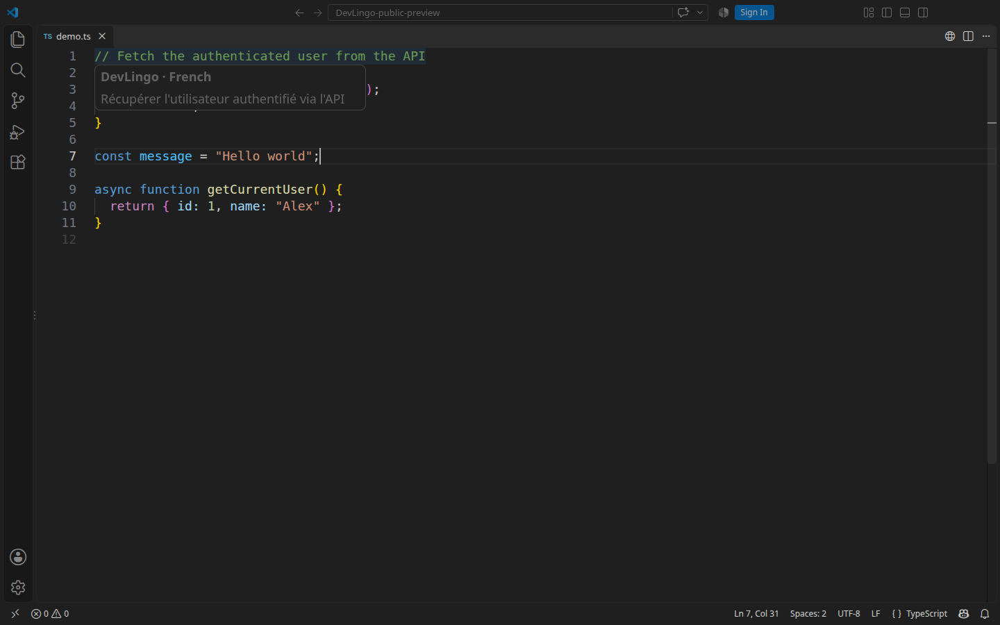
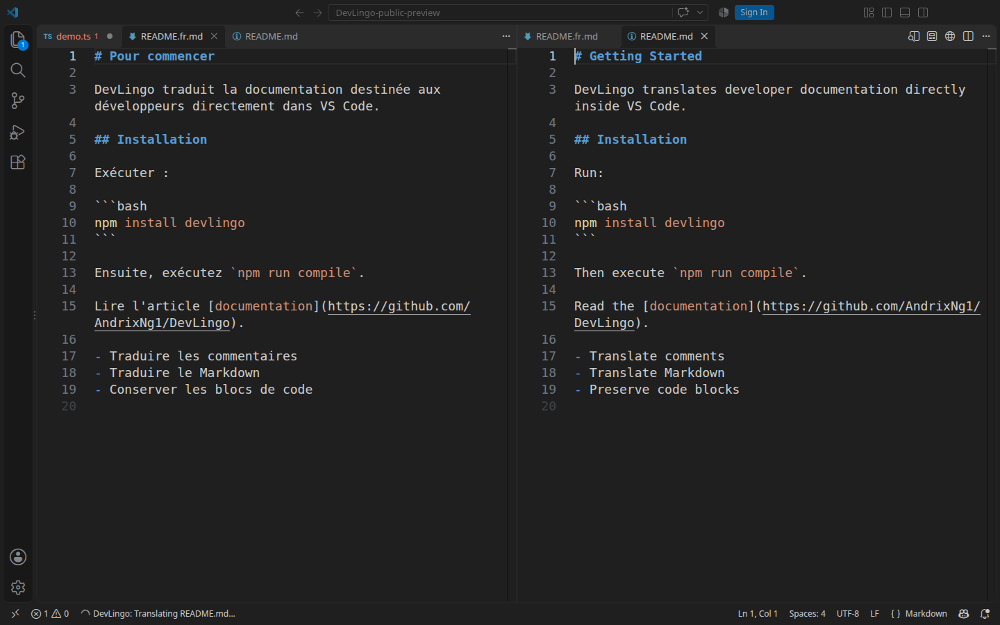
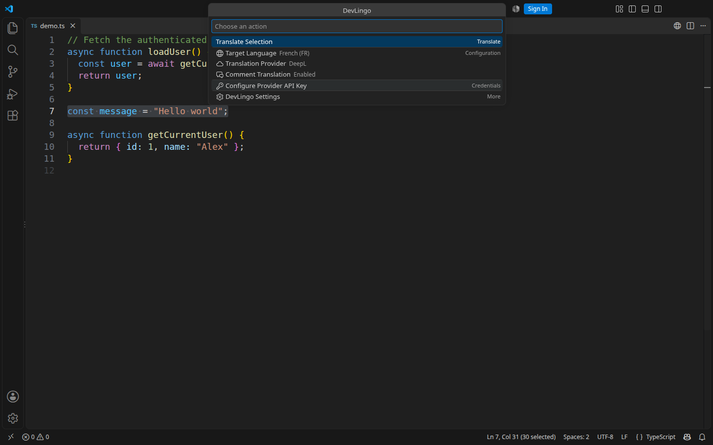
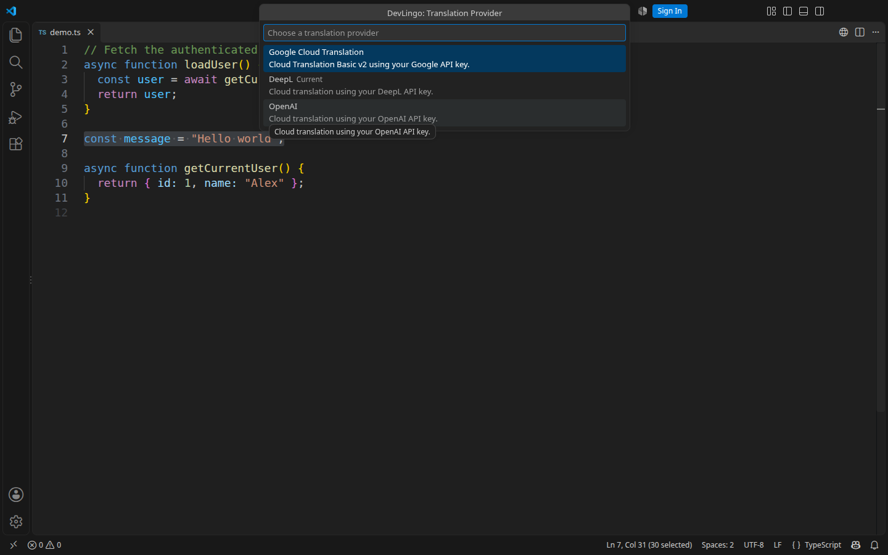

# DevLingo

> Translate developer content without leaving VS Code.


[](LICENSE)
[](https://github.com/AndrixNg1/DevLingo/actions/workflows/ci.yml)


DevLingo is a VS Code extension that translates **code comments, selected text and Markdown documentation** directly inside the editor. It helps you read unfamiliar comments and produce translated documentation while keeping code and Markdown syntax intact.

It supports **OpenAI, DeepL and Google Cloud Translation** through a **Bring Your Own Key (BYOK)** model. Choose a provider, configure your own API key, and start translating from native VS Code menus.

**Release status:** v1.0.0 is prepared locally and has not been published. Marketplace installation will be available after the public release.

## Quick Start

1. [Install the DevLingo VSIX](#installation) in VS Code 1.140.0 or later.
2. Open a file and click the **globe icon** in the editor title toolbar, or run **DevLingo: Open** in the Command Palette.
3. Choose **Translation Provider**: OpenAI, DeepL or Google Cloud Translation.
4. Choose **Configure Provider API Key**, select that provider and enter its key in the masked input.
5. Choose **Target Language**: English, French, Spanish or German.
6. Hover a supported code comment, translate a selection, or open a saved Markdown file and choose **Translate Markdown File**.

DeepL is the default provider, French is the default target, and comment translation is enabled by default. Every provider requires your own key.

## Installation

### Install from VSIX

Use a trusted `devlingo-1.0.0.vsix` supplied by the maintainer, or [build it from this repository](docs/development.md#package-and-install).

```sh
code --install-extension devlingo-1.0.0.vsix
```

Alternatively, open **VS Code → Extensions → … → Install from VSIX…** and select the file. To replace a previous local build, add `--force` to the command above.

**Marketplace installation will be available after the public release.** There is currently no public Marketplace installation link.

## Features

### Translate comments on hover

Open a supported source file and hover a comment:

```ts
// Fetch the authenticated user from the API
const user = await getCurrentUser();
```

DevLingo detects the comment, extracts its text and translates it through the selected provider. The result appears in the native **VS Code hover UI**, with DevLingo and the target language in the heading. The source code remains unchanged. Empty comments are ignored.



Supported language IDs are `javascript`, `javascriptreact`, `typescript`, `typescriptreact`, `vue`, `php`, `css`, `scss`, `less`, `python`, `shellscript` and `html`. DevLingo recognizes language-appropriate `//`, `#`, `/* … */` and `<!-- … -->` comments, including supported embedded script/style regions in HTML and Vue.

Detection uses a conservative lexical scan rather than a complete language parser. Report missed or incorrectly detected comments with a minimal example through [GitHub Issues](https://github.com/AndrixNg1/DevLingo/issues).

### Translate selected text

1. Select non-whitespace text in an editor.
2. Open DevLingo and choose **Translate Selection**.
3. Choose the target language in the selection-specific picker.
4. DevLingo translates through the current provider and opens the result in a temporary plaintext document beside the source.

The source document is unchanged. This action has its own language picker; it does not change the saved default target language. Save the result if you want to keep it.

You can also right-click a selection and choose **DevLingo: Translate Selection**, or run that command from the Command Palette.

### Translate Markdown files

Open a **saved local Markdown file**, choose your default target language, then run **DevLingo: Translate Markdown File** from the command center, editor context menu or Command Palette.

```text
README.md
    ↓ DevLingo: Translate Markdown File (French)
README.fr.md
```

DevLingo reads the current editor content, translates prose and writes a new file in the same folder. It adds the target language code before the original extension:

| Source | Target | Output |
| --- | --- | --- |
| `README.md` | French (`fr`) | `README.fr.md` |
| `guide.md` | Spanish (`es`) | `guide.es.md` |

**DevLingo does not overwrite the original Markdown file.** A progress notification names the source, and the translated document opens on success. If the output already exists, choose **Replace** or **Cancel**. Unsaved output documents must be saved or closed before replacement.

Untitled documents must be saved first. Markdown file translation currently supports local `file:` documents.



## Markdown Preservation

**Translate content, preserve structure.** DevLingo translates prose fragments and replaces only their original source ranges; it does not rebuild or reformat the entire document.

| Markdown content | Behavior |
| --- | --- |
| Headings and paragraphs | Translate text; preserve markers and layout |
| Bold, italic and strikethrough | Translate text; preserve delimiters |
| Ordered/unordered lists, task lists and blockquotes | Translate text; preserve markers and structure |
| GFM tables | Translate cell text; preserve table syntax |
| Inline code and fenced/indented code blocks | Preserve unchanged |
| Markdown links | Translate explicit labels; preserve destinations and titles |
| Raw URLs and autolinks | Preserve unchanged |
| Images | Preserve complete syntax, including alt text |
| Reference definitions | Preserve unchanged; full reference-link labels can be translated |
| Shortcut/collapsed reference links | Preserve unchanged to avoid breaking references |
| Horizontal rules | Preserve unchanged |
| Leading YAML frontmatter | Preserve a paired `---` block with a `---` or `...` closing delimiter |
| HTML nodes, comments and paired HTML regions | Preserve unchanged, including enclosed text |
| Existing escapes, entities and line endings | Preserve source syntax |

For example, given this input:

````md
# Installation

Run `npm install devlingo`.

```bash
npm install devlingo
```

Read the [documentation](https://example.com).
````

A conceptual French translation is:

````md
# Installation

Exécutez `npm install devlingo`.

```bash
npm install devlingo
```

Consultez la [documentation](https://example.com).
````

The inline command `npm install devlingo`, fenced code and `https://example.com` remain unchanged. This example illustrates preservation; wording depends on the provider.

Prose is translated in fragments around markup and line boundaries, so providers may have less context than when translating a complete paragraph. HTML content and image alt text are not translated. An unclosed HTML tag can conservatively protect the remainder of the document. Arbitrary frontmatter formats, MDX and every custom Markdown dialect are not guaranteed. Put identifiers that must remain literal in inline code and review output for your renderer.

See [Markdown behavior and limitations](docs/markdown.md) for details.

## DevLingo Command Center

The **globe icon** in the editor title toolbar opens a native VS Code QuickPick command center. It displays the current provider, target language and comment translation state.

| Action | Purpose |
| --- | --- |
| Translate Selection | Translate selected text; visible when a non-empty selection exists |
| Translate Markdown File | Translate the active Markdown document; visible in a Markdown editor |
| Target Language | Change the default target for comments and Markdown |
| Translation Provider | Select OpenAI, DeepL or Google Cloud Translation |
| Comment Translation | Toggle hover translation; shows Enabled or Disabled |
| Configure Provider API Key | Open secure credential configuration |
| DevLingo Settings | Open the extension's native VS Code settings |



All commands are also available in the **Command Palette**. Selection and Markdown actions have editor context-menu entries. **DevLingo: Remove Provider API Key** is available in the Command Palette and asks for confirmation before deleting a saved key.

## Translation Providers

| Provider | API Key Required | Status |
| --- | --- | --- |
| OpenAI | Yes | Supported |
| DeepL | Yes | Supported; default |
| Google Cloud Translation | Yes | Supported |

Open **DevLingo → Translation Provider** to switch. Changes take effect without reloading VS Code, and translation caches are renewed when the provider or credentials change. DevLingo does not automatically switch providers after a failure.



### OpenAI

Uses the OpenAI API through the official SDK and Responses API. Configure an **OpenAI API key** for an API account with access to the extension's configured model. There is no ChatGPT sign-in flow or model picker in v1.0.0. See [provider implementation details](docs/providers.md#openai).

### DeepL

Uses the official DeepL SDK. Configure your **DeepL API key**; the SDK selects the endpoint appropriate to the key. English output uses US English. DeepL is DevLingo's default provider.

### Google Cloud Translation

Uses **Cloud Translation Basic v2** through the official Google Cloud SDK. Configure a Google Cloud API key with the required API access, key restrictions and project billing/quota. Advanced v3 and service-account authentication are not supported.

Provider account access, billing, quotas and service availability are managed by the provider. [Provider documentation](docs/providers.md) covers implementation and how to add another provider.

## Bring Your Own Key

BYOK means **Bring Your Own Key**. You use an API key from your chosen provider. DevLingo does not sell translation credits, proxy requests through a DevLingo backend or bundle provider credentials. Translation requests go directly to the selected provider.

### Configure an API key

1. Open DevLingo from the editor toolbar or Command Palette.
2. Choose **Configure Provider API Key**.
3. Select **OpenAI**, **DeepL** or **Google Cloud Translation**.
4. Enter your key in the **masked input** and confirm.
5. DevLingo stores the key through VS Code SecretStorage.
6. Select that provider through **Translation Provider**, then translate normally.

Saving a key does not select its provider or validate it remotely. Provider and credential changes take effect without reloading. If a key is missing, DevLingo offers **Configure** or **Later**. Configure opens the selected provider's masked input directly; Later keeps the provider selected without translating.

### SecretStorage and security

Provider API keys are stored using **VS Code SecretStorage**. They are not written to repository files, `package.json`, `settings.json` or workspace files. Credential commands do not reveal or prefill a saved key.

Never commit credentials or include them in public issues, screenshots or logs. Revoke exposed keys with their provider. See [SECURITY.md](SECURITY.md) for credential handling and vulnerability reporting.

## Target Language

Open **DevLingo → Target Language** and choose:

| Language | Code |
| --- | --- |
| English | `en` |
| French (default) | `fr` |
| Spanish | `es` |
| German | `de` |

The saved target is reused for **comment hover and Markdown translation**. **Translate Selection asks for a language for each invocation**, using the same supported language list. Source language is automatically detected in normal UI workflows; there is no source-language setting or picker in v1.0.0.

## Comment Translation Toggle

Open **DevLingo → Comment Translation** to toggle hover translation. Its description displays **Enabled** or **Disabled**. The change takes effect immediately. Selection and Markdown commands remain available when hover translation is disabled.

### Settings

Open **DevLingo → DevLingo Settings**, or search for DevLingo in VS Code settings.

| Setting | Default | Purpose |
| --- | --- | --- |
| `devlingo.translationProvider` | `deepl` | Provider selection; application scope |
| `devlingo.targetLanguage` | `fr` | Default comment/Markdown target; can be overridden for a workspace |
| `devlingo.commentTranslationEnabled` | `true` | Comment hover toggle; application scope |

API keys are configured through commands, never these settings.

## Demo

The four screenshots above are real installed-extension captures. Comment and Markdown results were translated through DeepL into French. No GIF is bundled. See the [demo script](docs/demo-script.md) for the complete workflow and recording instructions.

## Troubleshooting

### Provider requires an API key

Choose **Configure** in the notification, or open **DevLingo → Configure Provider API Key** and configure the selected provider. Each provider has a separate saved key. Saving another provider's key does not satisfy the current provider.

### Invalid API key

Check that the key belongs to the selected provider and has not expired or been revoked. Check provider-specific permissions and restrictions. Regenerate it in the provider account if needed, then save it again through DevLingo's masked input.

### Translation provider quota reached

Check your provider account's billing, available credits and API quota. DevLingo cannot increase them. Exhausted credits/quota require a provider account change; a temporary rate limit may resolve after waiting and retrying.

### Markdown output file already exists

Choose **Replace** to overwrite the translated output or **Cancel** to keep it. The original Markdown file is preserved. Save or close an unsaved translated output before replacement.

### Comment translation does not appear

Check that **Comment Translation** is enabled, the correct provider is selected and its key is configured. Hover a non-empty comment in a supported language and syntax. Check network/provider availability. Hover failures remain quiet; try **Translate Selection** to see an actionable provider error.

### Provider unavailable

Check your network, the provider's API service and account configuration. For Google Cloud, verify Cloud Translation Basic v2 is enabled and the API key restrictions allow it. If an older setting refers to the removed development provider, select a supported provider explicitly.

If the problem persists, open a [GitHub issue](https://github.com/AndrixNg1/DevLingo/issues/new/choose) with your VS Code/DevLingo versions, provider name and a minimal non-sensitive reproduction. Never include an API key.

## Privacy

DevLingo sends the content needed for translation directly to the selected external provider:

- **Comment hover:** extracted comment text, without delimiters.
- **Selection:** the selected text.
- **Markdown:** translatable prose segments; protected code, URLs, images and other protected ranges are not sent by this workflow.

Target-language information and provider-specific request instructions/options accompany the text. DevLingo does not scan or send the whole workspace. Hover and Markdown translations use bounded in-memory caches; they are not persisted. Markdown output is saved only as the requested translated file.

Review your provider's data policies before translating sensitive content. DevLingo does not make promises about an external provider's retention policy. See [SECURITY.md](SECURITY.md).

## Development

Requirements: **Git, Node.js 22, npm and Visual Studio Code 1.140.0 or later**.

```sh
git clone https://github.com/AndrixNg1/DevLingo.git
cd DevLingo
npm install
npm run lint
npm run compile
npm test
```

Open the repository in VS Code, press **F5**, and select **Run Extension** to launch an Extension Development Host. Tests use offline fixtures and injected clients, without real API keys. See [development and packaging](docs/development.md) for headless Linux testing and VSIX validation.

### Project structure

```text
src/
├── commands/
├── comments/
├── config/
├── hover/
├── markdown/
├── translation/
│   └── providers/
├── ui/
├── test/
└── extension.ts
```

### Technical documentation

- [Architecture](docs/architecture.md)
- [Translation providers and adding a provider](docs/providers.md)
- [Markdown preservation and limitations](docs/markdown.md)
- [Development, testing and packaging](docs/development.md)
- [Contributing](CONTRIBUTING.md)
- [Security policy](SECURITY.md)
- [Roadmap](ROADMAP.md) and [changelog](CHANGELOG.md)

## Contributing

Contributions are welcome: bug fixes, translation providers, language support, Markdown edge cases, documentation and UX improvements. Start with [CONTRIBUTING.md](CONTRIBUTING.md) and follow the [code of conduct](CODE_OF_CONDUCT.md).

## Support

Use [GitHub Issues](https://github.com/AndrixNg1/DevLingo/issues) for reproducible bugs and feature requests. For vulnerabilities, follow the private reporting guidance in [SECURITY.md](SECURITY.md).

## License

DevLingo is licensed under the [MIT License](LICENSE).
