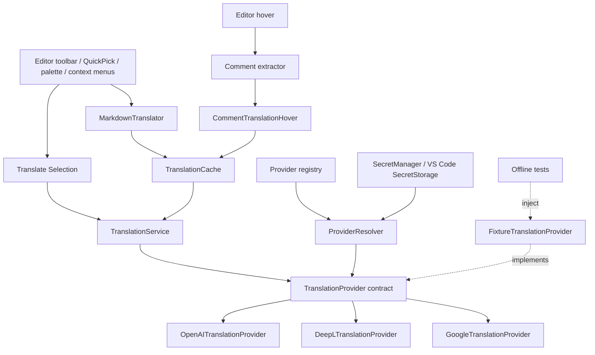

# Architecture

DevLingo v1.0.0 keeps editor features independent of the selected translation provider. Production composition uses OpenAI, DeepL or Google Cloud Translation; offline development and tests can inject mock implementations of the same contract.

`src/extension.ts` composes dependencies and registers features/disposables. It contains no comment parsing, Markdown processing or provider-specific translation logic.

- **Commands** (`src/commands/`) coordinate editor input, native pickers, notifications and output documents.
- **Command center** (`src/ui/`) builds context-sensitive QuickPick actions. It reads only boolean credential status, routes existing commands and never constructs providers or translates on opening.
- **Settings** (`src/config/settings.ts`) centralize configuration; `languages.ts` centralizes supported target languages.
- **Provider registry/resolver** (`src/translation/providers/`) hold immutable metadata and the only concrete construction switch. Unknown providers and missing credentials are explicit errors, with no fallback.
- **SecretManager** (`src/config/secrets.ts`) delegates credential storage to VS Code SecretStorage using provider-specific keys. It does not persist keys in workspace files.
- **TranslationService** depends only on `TranslationProvider`, preserving whitespace-only input unchanged. The contract accepts a target and optional source language.
- **Comment extractor** conservatively scans supported syntaxes while skipping strings. Hover escapes untrusted translation output and suppresses cancelled, stale, disabled and failed results.
- **MarkdownTranslator** extracts prose source ranges, protects syntax and replaces only those ranges. File commands handle safe sibling names and explicit overwrite confirmation.
- **TranslationCache** shares pending/completed promises in a bounded 100-entry map. Keys include provider ID, text, target and optional source language. Failures are evicted; oldest entries are removed at capacity. It is not persistent and has no TTL.

`registerTranslationFeatures.ts` disposes and reconstructs features, services and caches on provider or credential changes. Revision checks prevent older asynchronous resolutions from replacing the current provider. Hover and Markdown use separate cache instances; selection calls the service directly.

Tests inject fake clients or the test-only [`FixtureTranslationProvider`](../src/test/helpers/fixtureTranslationProvider.ts). This deterministic mock implements `TranslationProvider` and never enters the production registry or resolver. See [mock providers](providers.md#mock-providers-for-development-and-testing), [adding providers](providers.md#adding-a-new-provider) and [Markdown details](markdown.md).
